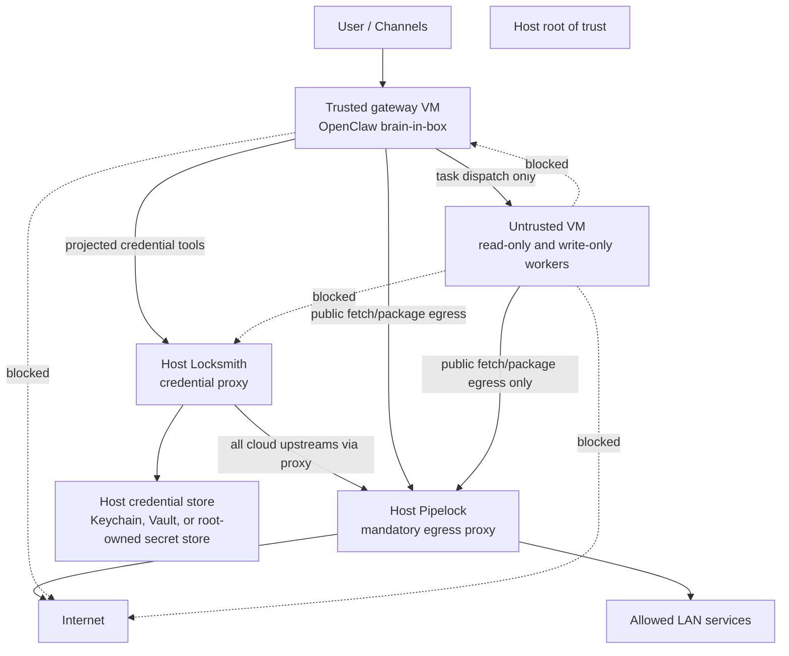

# Host-Side Pipelock and Locksmith Target Architecture

This document defines the target architecture for running OpenClaw in a
trusted gateway plus untrusted sandbox layout where the security membrane is
owned by the host, not by either VM.

The current Lima development VMs are disposable. They are useful for
iteration, but the long-term deliverable is an idempotent clean install that
can destroy and recreate VMs when that is safer than repairing drift.

## Decision Summary

Pipelock and Locksmith should both live on the host.

- Pipelock is deterministic egress policy. It has no business being inside an
  agent-controlled VM if the host can enforce it from outside the VM.
- Locksmith is the credential boundary. It should hold or access upstream
  credentials outside the gateway VM so gateway compromise does not expose raw
  API keys.
- The untrusted VM must never reach Locksmith. It gets package/web egress
  through Pipelock only.
- The gateway VM reaches Locksmith for projected, credential-bearing tools and
  reaches Pipelock for non-credential public egress.
- Direct VM-to-internet egress is blocked by the host firewall. Pipelock is a
  required choke point, not a proxy preference.

In hardened mode, OpenClaw should fail closed when Locksmith is configured as
required and unavailable. There should be no direct credential fallback path.

## Trust Zones



## Required Traffic Flows

### Gateway VM

Allowed:

- User/channel traffic needed for OpenClaw to talk to the outside user.
- Gateway-to-host Pipelock for general public HTTP/HTTPS egress.
- Gateway-to-host Locksmith for projected credential-backed tool calls.
- Gateway-to-untrusted task dispatch through the selected sandbox transport
  such as SSH, with host firewall rules limiting direction and port.

Denied:

- Direct internet egress.
- Raw upstream credentials in config, environment, files, tool parameters, or
  model-visible context.
- Broad access to host services other than the specifically exposed Pipelock
  and Locksmith endpoints.

### Untrusted VM

Allowed:

- Untrusted-to-host Pipelock for public egress such as package installs,
  source checkout, and non-secret web fetches.
- Return traffic over the task transport initiated by the gateway.

Denied:

- Any access to Locksmith.
- Direct internet egress.
- Direct gateway API access.
- Lateral VM-to-VM network access except the explicit task transport.
- Credential-bearing tools by default.

### Host

Allowed:

- Pipelock egress to internet and approved LAN targets according to policy.
- Locksmith egress only through Pipelock for cloud tools, or direct to
  explicitly configured local/LAN tool endpoints.
- Operator management access from configured management CIDRs or local console.

Denied:

- Any VM source IP bypassing Pipelock for internet egress.
- Any untrusted VM source IP reaching Locksmith.
- Any VM changing Pipelock, Locksmith, firewall, or credential-store config.

## Firewall Enforcement

The host firewall is the authoritative control. Proxy environment variables
inside a VM are only ergonomic hints.

On macOS development hosts, this means PF anchors plus macOS Application
Firewall allowlisting for the host listener binaries. On Linux hosts, this
means nftables. The conceptual policy is the same:

```text
allow host loopback
allow established/related

allow gateway_vm -> host:pipelock_port
allow gateway_vm -> host:locksmith_port
allow gateway_vm -> untrusted_task_transport_port

allow untrusted_vm -> host:pipelock_port
block untrusted_vm -> host:locksmith_port
block untrusted_vm -> gateway_api_port
block untrusted_vm -> gateway_vm

block gateway_vm -> internet
block untrusted_vm -> internet

allow _pipelock_user -> internet:80,443
allow _locksmith_user -> host:pipelock_port
block all other egress by default
```

If Pipelock is down, both VMs should lose public internet access. That is the
correct failure mode.

### macOS VZ and Lima Notes

Apple VZ/Lima exposes multiple useful paths:

- `192.168.64.1` is the host bridge address. Use this for enforced host
  services because PF can distinguish gateway and untrusted VM source IPs.
- `host.lima.internal` normally traverses Lima's shared NAT path. It is useful
  for host-forwarded task transports such as SSH, but both VMs may appear as a
  shared source there. Do not use that path for privileged boundary decisions.
- Existing experiments may have left an `openclaw-lima-egress` PF anchor. The
  host-boundary role removes that legacy anchor because its quick rules can
  shadow the host-owned policy.
- The macOS Application Firewall can allow a TCP handshake while preventing an
  unsigned/new listener from reading application data. The role allowlists the
  managed Pipelock, Locksmith, and Locksmith bridge binaries instead of
  disabling the firewall.

OpenClaw's required-Locksmith startup guard currently expects a loopback
Locksmith URL. For a host-side Locksmith deployment, keep the OpenClaw plugin
URL as `http://127.0.0.1:9200` inside the gateway VM and run a tiny
gateway-local loopback forward to the host bridge endpoint:

```text
gateway OpenClaw -> 127.0.0.1:9200
127.0.0.1:9200 -> 192.168.64.1:9200
192.168.64.1:9200 -> host Locksmith bridge -> 127.0.0.1:9201
```

This preserves OpenClaw's loopback guard while the actual credential boundary
and network enforcement remain host-owned.

## Credential Boundary

Locksmith is not a generic host-side HTTP proxy. Treating it as one creates a
host SSRF pivot and overbroad authority.

Required Locksmith semantics:

- Each tool has an explicit upstream base URL or endpoint template.
- Requests cannot override the upstream host outside that tool policy.
- Agent-supplied auth-ish headers are stripped before proxying:
  `Authorization`, `Proxy-Authorization`, `X-API-Key`, and equivalents.
- Raw upstream credentials are never returned to OpenClaw.
- Cloud upstreams go through Pipelock.
- Local/LAN upstreams are explicit per tool.
- Admin API and tool API are separate surfaces with separate auth.
- Audit logs include caller identity, tool slug, upstream target, decision,
  status, and byte counts, but never raw credentials.

The gateway's Locksmith token is still authority. It must be scoped.

Recommended token model:

- Per-client token allowlist of tool slugs.
- Optional per-agent or per-profile token scopes.
- Rate limits per token and per tool.
- Token rotation as part of VM reprovisioning.
- Short-lived or revocable capability tokens when practical.

The goal is that compromise of the gateway token grants only the projected
capabilities configured for that gateway profile, not the whole credential
store.

## OpenClaw Runtime Model

OpenClaw should remain an application runtime, not the owner of host firewall
or credential storage.

In `openclaw-exocortex`:

- The Locksmith plugin discovers `GET /tools`.
- Hardened config sets Locksmith as required.
- The generic `locksmith_call` tool is hidden or disabled by default in the
  hardened profile.
- Projected tools are generated from the Locksmith catalog and filtered by
  configured policy.
- Tool policies are per agent profile.
- Fail-closed behavior prevents direct credential fallback when Locksmith is
  unavailable.

The intended agent capability split is:

- `main` is the trusted brain-in-box. It talks to the user, manages state in
  its workspace, plans work, and delegates risky tasks. It should not have raw
  network, raw shell egress, or raw credentials.
- `untrusted-read` can read and summarize untrusted inputs but cannot mutate
  durable state or call credential tools.
- `untrusted-write` can apply bounded writes in an assigned workspace but
  cannot read arbitrary external content or call credential tools.
- Broader untrusted workers may exist for development, but they are not the
  default hardened posture.

This creates multiple membranes for prompt injection: untrusted content must
survive a read-only worker, then the brain-in-box, then a write-only worker
before it can mutate state.

## Clean Install Sequence

The clean install should be owned by `openclaw-hardened` and should be
idempotent. For local VM deployments, it may recreate the gateway and
untrusted VMs when their network shape or trust material is stale.

1. Host preflight:
   - Detect platform: macOS/PF/launchd or Linux/nftables/systemd.
   - Verify required privileges.
   - Install required package manager dependencies.
   - Generate or load site-specific secret material.

2. Host security services:
   - Install Pipelock on the host.
   - Install Locksmith on the host.
   - Configure credential store access for Locksmith.
   - Configure service identities and minimal filesystem permissions.
   - Start services and verify local health.

3. VM provisioning:
   - Create or recreate gateway VM.
   - Create or recreate untrusted VM.
   - Assign stable VM identities where possible. If stable IPs are not
     available, detect IPs after boot and render firewall rules from detected
     values.
   - Do not mount host home into the untrusted VM.

4. Host firewall:
   - Render PF or nftables rules from detected VM identities.
   - Permit only the required crossings.
   - Block direct VM internet egress.
   - Block untrusted access to Locksmith and gateway APIs.
   - Reload firewall atomically and verify counters.

5. Gateway configuration:
   - Install or update OpenClaw.
   - Render OpenClaw config with required Locksmith enabled. On current
     OpenClaw, render a gateway-local loopback Locksmith URL and forward that
     loopback port to the host Locksmith endpoint.
   - Render Pipelock proxy settings for non-credential egress.
   - Render agent profiles and subagent routing.
   - Restart OpenClaw.

6. Verification:
   - Gateway can reach Locksmith `/tools`.
   - Gateway cannot reach internet directly with proxy variables unset.
   - Gateway can reach internet through Pipelock.
   - Untrusted cannot reach Locksmith.
   - Untrusted cannot reach gateway API.
   - Untrusted cannot reach internet directly.
   - Untrusted can reach internet through Pipelock.
   - A projected Locksmith tool works from the gateway and is audited.
   - No raw upstream credentials appear in OpenClaw config, environment, logs,
     or agent-visible tool output.

## Current Implementation

The first implementation is an opt-in host-boundary playbook:

```bash
ansible-playbook -i inventory/hosts.yml \
  ../openclaw-hardened/playbook-host-boundary.yml \
  --ask-become-pass
```

It targets the `host_boundary` inventory group and currently implements the
macOS/Lima path:

- `roles/host_boundary` renders host Pipelock and Locksmith configs.
- It can install LaunchDaemons for host-owned Pipelock and Locksmith.
- Locksmith's LaunchDaemon plist stays non-secret; upstream API keys and the
  inbound token are written only to a root-only wrapper script.
- It can render gateway and untrusted Lima YAMLs for clean installs.
- It detects the gateway and untrusted VM source IPs from inside the guests.
- It renders a PF anchor that permits only the required crossings and blocks
  direct VM egress.
- It verifies the core positive and negative paths after PF reload.

Host Pipelock and Locksmith bind on wildcard addresses in the macOS VM layout
so Lima guests can reach them through `host.lima.internal`. That is acceptable
only with the PF anchor enabled. The role fails by default if wildcard service
binds are requested with PF disabled.

Gateway-to-untrusted task dispatch is explicit. Add the untrusted SSH host
forward to `host_boundary.pf.task_transport_host_ports`, or opt in to
`host_boundary.pf.auto_allow_untrusted_ssh` for Lima SSHLocalPort discovery.
The auto-allow path is disabled by default.

The role is separate from the existing Linux/systemd/nftables playbook on
purpose. The Linux agent-host roles remain the production single-host path;
the host-boundary playbook is the local VM boundary path.

### macOS Lima Note

Apple VZ NAT behavior is the load-bearing detail. In the current Lima
development setup, PF counters show distinct VM source IPs for the gateway and
untrusted guests. The role therefore discovers guest source IPs with:

```bash
limactl shell <vm> -- ip route get 1.1.1.1
```

That value must be PF-visible for the boundary to be meaningful. The
verification phase checks that the resulting PF anchor is loaded and that
untrusted cannot reach Locksmith while both VMs can use Pipelock. If a future
Lima networking mode hides guest source IPs from PF, switch the VM templates to
a PF-visible network such as socket_vmnet before relying on this boundary.

Some Lima topologies expose a second shared NAT source for default internet
egress. Put those addresses in
`host_boundary.vm_ips.extra_direct_egress_sources`; the PF anchor blocks them
from direct egress without treating them as trusted service identities.

### OpenClaw Compatibility

This design does not require OpenClaw core changes. The gateway consumes the
boundary through ordinary config:

- the bundled Locksmith plugin is enabled;
- `genericTool` is disabled in hardened mode;
- projected `locksmith_<slug>` tools are rendered from the deployment config;
- `LOCKSMITH_INBOUND_TOKEN` is supplied through the service environment.
- per-agent `tools`, `subagents`, and `sandbox` blocks are passed through from
  site config so read-only/write-only worker profiles do not require core code
  changes.

All host firewalling, service lifecycle, VM provisioning, and credential store
placement remain in `openclaw-hardened` and `agent-locksmith`, not in OpenClaw
core.

## Repository Ownership

| Responsibility | Owning repo |
| --- | --- |
| Host service install for Pipelock | `deps/exocortex-openclaw-hardened` |
| Host service install for Locksmith | `deps/exocortex-openclaw-hardened` |
| PF/nftables rules for host-enforced VM egress | `deps/exocortex-openclaw-hardened` |
| Lima or other VM provisioning for hardened layouts | `deps/exocortex-openclaw-hardened` |
| Verification scripts and posture checks | `deps/exocortex-openclaw-hardened` |
| OpenClaw Locksmith plugin and projected tools | `openclaw-exocortex` |
| Per-agent OpenClaw tool policy config support | `openclaw-exocortex` |
| Credential proxy API, scoped tokens, audit format | `deps/exocortex-agent-locksmith` |
| Credential storage implementation details | `deps/exocortex-agent-locksmith` plus host provisioning in `deps/exocortex-openclaw-hardened` |
| Untrusted content scanning and quarantine | `deps/exocortex-untrusted-content` |

The current `openclaw-exocortex/scripts/dev/lima` helpers are acceptable as a
development bridge, but the target clean install belongs in
`openclaw-hardened`.

## Remaining Backlog

1. Extend the host-boundary implementation:
   - Add the Linux/nftables host path.
   - Add stable VM identity support where the runtime allows it.
   - Add PF counter assertions that prove the rendered source IPs are the
     ones carrying blocked traffic.
   - Add install tasks for Pipelock and Locksmith binaries, not just managed
     service configuration.

2. Extend `agent-locksmith`:
   - Per-token tool allowlists.
   - Admin/tool API split if not already present.
   - Explicit upstream base URL enforcement per tool.
   - Structured audit log.
   - Strong response-size caps and header scrubbing defaults.

3. Tighten `openclaw-exocortex` hardened config:
   - Required Locksmith mode.
   - Disable generic Locksmith tool by default.
   - Project only allowed tool slugs.
   - Express read-only and write-only untrusted agent profiles.
   - Surface runtime/host identity in subagent metadata for auditability.

4. Add posture tests:
   - Direct egress block tests from each VM.
   - Proxy success tests through Pipelock.
   - Locksmith deny tests from untrusted.
   - Locksmith success tests from gateway.
   - Credential non-disclosure scans over config, environment, logs, and tool
     outputs.

## Open Questions

- The preferred host credential store is platform-specific. On macOS, Keychain
  is the likely default. On Linux, use either Ansible Vault material rendered
  into a root-only service environment, an OS keyring, or an external vault.
- Pipelock policy shape must decide where the default is allow-with-blocklist
  versus deny-with-allowlist. For untrusted package installation, the default
  probably needs to be more permissive than the gateway's policy, but still
  logged and blocklisted.
- The VM transport should be abstracted. Lima is the local macOS target, but
  the host-side architecture should also work for other VM/container runtimes
  that expose stable source identities to the host firewall.
- LlamaFirewall is intentionally out of scope for this step. It can be added
  later as another host-side or gateway-side inference membrane.
